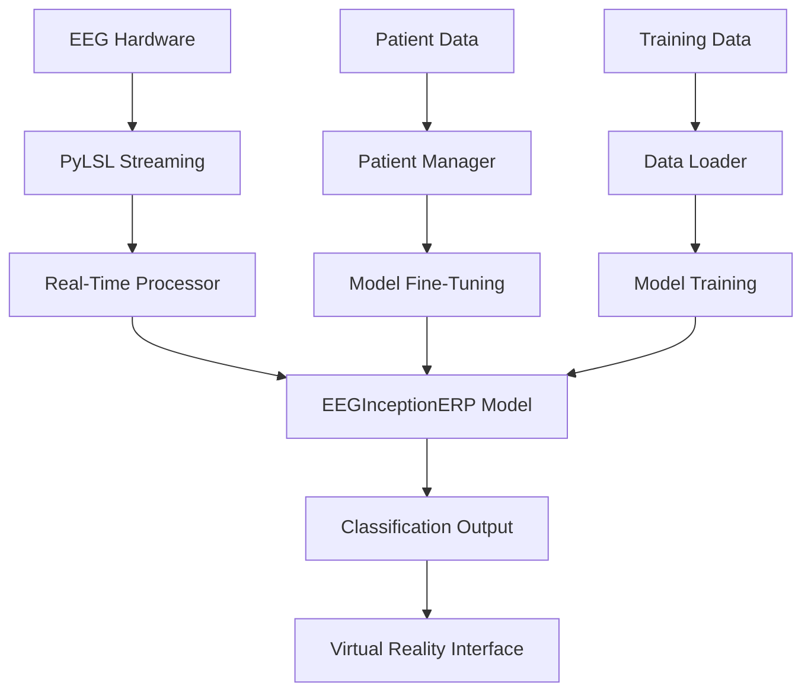

# BCI EEG Motor Imagery Classification System - Complete Documentation

## Table of Contents

1. [Project Overview](#project-overview)
2. [System Architecture](#system-architecture)
3. [Installation Guide](#installation-guide)
4. [User Guides](#user-guides)
   - [DevTools Version](#devtools-version)
   - [EndUser Version](#enduser-version)
5. [Developer Documentation](#developer-documentation)
6. [API Reference](#api-reference)
7. [Model Architecture](#model-architecture)
8. [Data Management](#data-management)
9. [Patient Management](#patient-management)
10. [Training & Fine-Tuning](#training--fine-tuning)
11. [Real-Time EEG Processing](#real-time-eeg-processing)
12. [Troubleshooting](#troubleshooting)
13. [Contributing](#contributing)

---

## Project Overview

The BCI (Brain-Computer Interface) EEG Motor Imagery Classification System is a comprehensive research and clinical platform that implements state-of-the-art deep learning techniques for motor imagery classification from EEG signals. The system is designed to help stroke patients rehabilitate through BCI-controlled virtual reality applications.

### Key Features

- **Dual Interface Design**: Separate versions for researchers/developers (DevTools) and clinical use (EndUser)
- **EEGInceptionERP Model**: State-of-the-art CNN architecture from braindecode for EEG classification
- **Real-Time Processing**: Live EEG streaming via PyLSL for real-time inference
- **Patient Management**: Comprehensive patient registration and data management system
- **Model Fine-Tuning**: Patient-specific model adaptation capabilities
- **Data Visualization**: Advanced EEG signal visualization and analysis tools

### Target Applications

- **Stroke Rehabilitation**: BCI-controlled virtual reality therapy
- **Research**: EEG motor imagery classification studies
- **Clinical Assessment**: Patient-specific model development
- **Real-Time BCI**: Live brain-computer interface applications

---

## System Architecture

The BCI system follows a modular architecture with clear separation between research tools and clinical applications:

```
BCI System
├── DevTools (Research/Development Environment)
│   ├── Data Management Tab
│   ├── Model Training Tab
│   ├── Fine-Tuning Tab
│   └── PyLSL Live Recording Tab
├── EndUser (Clinical Environment)
│   ├── Patient Management Tab
│   └── PyLSL Live Recording Tab
└── Core Components
    ├── EEGInceptionERP Model
    ├── Data Processing Pipeline
    ├── Real-Time Inference Engine
    └── Patient Data Manager
```

### Component Relationships



### Technology Stack

- **Frontend**: PyQt5 for cross-platform GUI
- **Deep Learning**: PyTorch with braindecode models
- **Data Processing**: NumPy, SciPy, pandas
- **Visualization**: Matplotlib, seaborn
- **Real-Time Streaming**: PyLSL (Lab Streaming Layer)
- **Data Storage**: CSV files, JSON configuration

---

## Installation Guide

### Prerequisites

- Python 3.8 or higher
- CUDA-compatible GPU (recommended for training)
- OpenBCI or compatible EEG hardware (for live recording)

### Dependencies

```txt
PyQt5>=5.15.0
numpy>=1.19.0
pandas>=1.1.0
torch>=1.7.0
torchvision>=0.8.0
matplotlib>=3.3.0
seaborn>=0.11.0
scipy>=1.5.0
braindecode>=0.8.0
pylsl>=1.16.0
scikit-learn>=0.24.0
```

### Installation Steps

1. **Clone the Repository**
   ```bash
   git clone <repository-url>
   cd projetoBCI
   ```

2. **Create Virtual Environment**
   ```bash
   python -m venv bci_env
   source bci_env/bin/activate  # On Windows: bci_env\Scripts\activate
   ```

3. **Install Dependencies**
   ```bash
   pip install -r requirements.txt
   ```

4. **Verify Installation**
   ```bash
   python launch_bci.py --check-deps
   ```

### Data Setup

1. **Download PhysioNet Dataset**
   ```bash
   python scripts/download_physionet_data.py
   ```

2. **Prepare Directory Structure**
   ```
   projetoBCI/
   ├── eeg_data/
   │   ├── S001/
   │   ├── S002/
   │   └── ...
   ├── patient_data/
   ├── models/
   └── logs/
   ```

---

## User Guides

### DevTools Version

The DevTools version provides a comprehensive development and research environment for EEG data analysis, model training, and fine-tuning.

#### Launching DevTools

```bash
python launch_bci.py --mode gui
```

#### Data Management Tab

**Purpose**: Load, visualize, and manage EEG datasets for training and analysis.

**Features**:
- Multi-subject data loading from PhysioNet format
- Real-time EEG signal visualization
- Data preprocessing and filtering
- Sample navigation and inspection

**Usage**:
1. **Select Data Directory**: Click "Browse EEG Data Directory" and select your data folder
2. **Choose Subjects**: Enter subject IDs (e.g., "1,2,3") or "all" for all subjects
3. **Load Data**: Click "Load and Process Data" to load and preprocess the data
4. **Navigate Samples**: Use Previous/Next buttons to browse through EEG samples
5. **View Statistics**: Check the data summary panel for dataset information

#### Training Tab

**Purpose**: Train new EEGInceptionERP models from scratch using loaded datasets.

**Features**:
- Configurable training parameters
- K-fold cross-validation
- Real-time training progress monitoring
- Model checkpointing and saving

**Usage**:
1. **Model Naming**: Enter a unique name for your model
2. **Parameter Configuration**: 
   - Choose "Default Parameters" for standard training
   - Choose "Custom Parameters" to modify epochs, learning rate, etc.
3. **Start Training**: Click "Start Training" to begin the process
4. **Monitor Progress**: Watch the training log for real-time updates
5. **Save Results**: Trained models are automatically saved to the models directory

#### Fine-Tuning Tab

**Purpose**: Adapt pre-trained models to specific patients or datasets.

**Features**:
- Patient-specific data management
- Recording session organization
- Transfer learning with freeze strategies
- Training curve visualization
- Model comparison tools

**Usage**:
1. **Load Patient**: Enter patient ID and click "Load Patient Data"
2. **Add Sessions**: Click "Add Session" to include recording files
3. **Configure Fine-Tuning**:
   - Select pre-trained model
   - Choose freeze strategy (early, most, none, all)
   - Set learning rate ratio and epochs
4. **Start Fine-Tuning**: Monitor progress in real-time
5. **Compare Results**: Use the model comparison tab to evaluate performance

#### PyLSL Tab

**Purpose**: Record live EEG data from connected hardware.

**Features**:
- Real-time stream detection
- Live signal visualization
- Automated file saving
- Stream configuration

**Usage**:
1. **Connect Hardware**: Ensure EEG device is streaming via LSL
2. **Refresh Streams**: Click to detect available streams
3. **Select Recording Folder**: Choose destination for saved files
4. **Start Recording**: Begin live data collection
5. **Monitor Signals**: View real-time EEG data
6. **Stop Recording**: End session and save data

### EndUser Version

The EndUser version provides a streamlined clinical interface focused on patient management and real-time BCI applications.

#### Launching EndUser

```bash
python launch_enduser.bat
```

#### Patient Management Tab

**Purpose**: Register and manage patient information for clinical BCI applications.

**Features**:
- Patient registration with clinical data
- Patient selection for sessions
- Data organization by patient
- Clinical information tracking

**Usage**:
1. **Register New Patient**:
   - Click "New Patient"
   - Fill in patient information (ID, name, age, gender)
   - Add clinical details (affected hand, onset time)
   - Click "Register Patient"

2. **Select Existing Patient**:
   - Choose patient from the list
   - View patient details
   - Click "Select Patient" for current session

3. **Patient Data Organization**:
   - Each patient gets a dedicated folder structure
   - Automatic organization of recordings and models
   - Training history tracking

#### PyLSL Tab (EndUser)

**Purpose**: Conduct BCI sessions with selected patients.

**Features**:
- Patient-specific recording folders
- Automatic file organization
- Real-time inference (future feature)
- Session management

**Usage**:
1. **Select Patient**: Must select a patient first in Patient Management tab
2. **Recording Setup**: Folder is automatically configured for selected patient
3. **Start Session**: Begin EEG recording for current patient
4. **Real-Time Processing**: Live classification and feedback (in development)

---

## Developer Documentation

### Code Organization

The project follows a modular structure with clear separation of concerns:

```
projetoBCI/
├── DevTools/                 # Research/development version
│   └── src/
│       ├── UI/              # GUI components
│       ├── data/            # Data handling
│       ├── model/           # Model implementations
│       └── utils/           # Utility functions
├── EndUser/                 # Clinical version
│   └── src/
│       ├── UI/              # Patient-focused GUI
│       ├── data/            # Patient data management
│       ├── model/           # Model inference
│       └── utils/           # Clinical utilities
├── src/                     # Shared components
│   ├── data/               # Core data processing
│   ├── model/              # Model architectures
│   └── utils/              # Common utilities
├── docs/                   # Documentation
├── tests/                  # Unit tests
└── scripts/                # Utility scripts
```

### Key Classes

#### EEGInceptionERPModel
```python
class EEGInceptionERPModel(BaseModel):
    """
    Main model class wrapping braindecode's EEGInceptionERP.
    
    Args:
        n_chans (int): Number of EEG channels
        n_outputs (int): Number of output classes
        n_times (int): Number of time points
        sfreq (float): Sampling frequency
    """
```

#### RealTimeInferenceProcessor
```python
class RealTimeInferenceProcessor:
    """
    Handles real-time EEG processing with sliding window approach.
    
    Features:
    - 400-sample sliding window
    - Real-time filtering
    - Model inference
    - Prediction output
    """
```

#### PatientDataManager
```python
class PatientDataManager:
    """
    Manages patient-specific data organization and processing.
    
    Features:
    - Patient folder structure
    - Recording session management
    - Data preprocessing
    - Model training data preparation
    """
```

### Adding New Features

#### Creating a New Tab

1. **Create Tab Class**:
   ```python
   class NewTab(QWidget):
       def __init__(self, parent_main_window):
           super().__init__()
           self.main_window = parent_main_window
           self.setup_ui()
   ```

2. **Add to Main Window**:
   ```python
   self.new_tab = NewTab(self)
   self.tabs.addTab(self.new_tab, "New Tab")
   ```

#### Extending the Model

1. **Inherit from BaseModel**:
   ```python
   class CustomModel(BaseModel):
       def __init__(self, ...):
           super().__init__(...)
           # Custom implementation
   ```

2. **Implement Required Methods**:
   - `forward()`
   - `save()`
   - `load()`
   - `get_features()`

### Testing

#### Running Tests
```bash
python -m pytest tests/
```

#### Adding Tests
```python
def test_model_forward():
    model = EEGInceptionERPModel(n_chans=16, n_outputs=2, n_times=400, sfreq=125)
    input_tensor = torch.randn(1, 16, 400)
    output = model(input_tensor)
    assert output.shape == (1, 2)
```

---

## API Reference

### Core Model API

#### EEGInceptionERPModel

**Constructor**
```python
EEGInceptionERPModel(
    n_chans: int,
    n_outputs: int, 
    n_times: int,
    sfreq: float,
    model_name: str = "EEGInceptionERP",
    drop_prob: float = 0.5,
    n_filters: int = 8,
    model_version: str = "1.0"
)
```

**Methods**

`forward(x: torch.Tensor) -> torch.Tensor`
- Performs forward pass through the model
- **Args**: Input tensor (batch_size, n_channels, n_times)
- **Returns**: Output predictions (batch_size, n_outputs)

`save(file_path: str) -> None`
- Saves model state and configuration
- **Args**: Path to save the model file

`load(file_path: str) -> None`
- Loads model state and configuration
- **Args**: Path to the model file

`get_features(x: torch.Tensor) -> torch.Tensor`
- Extracts features from penultimate layer
- **Args**: Input tensor
- **Returns**: Feature tensor

#### Data Loader API

**BCIDataLoader**
```python
BCIDataLoader(
    data_path: str,
    subjects: List[int] = None,
    runs: List[int] = [4, 8, 12],
    window_length: float = 3.2,
    overlap: float = 0.0
)
```

**Methods**

`load_all_subjects() -> Tuple[np.ndarray, np.ndarray, np.ndarray]`
- Loads data from all specified subjects
- **Returns**: (windows, labels, subject_ids)

`load_subject(subject_id: int) -> Dict`
- Loads data from a single subject
- **Returns**: Dictionary with EEG data and events

#### Real-Time Processing API

**RealTimeInferenceProcessor**
```python
RealTimeInferenceProcessor(
    model,
    n_channels: int = 16,
    sample_rate: float = 125.0,
    window_size: int = 400,
    filter_enabled: bool = True
)
```

**Methods**

`add_samples(samples: np.ndarray) -> None`
- Adds new samples to the buffer
- **Args**: New EEG samples (n_channels,) or (n_samples, n_channels)

`predict(new_samples: Optional[np.ndarray] = None) -> Dict[str, Any]`
- Performs prediction on current window
- **Returns**: Dictionary with predictions and confidence

### Patient Management API

**PatientDataManager**
```python
PatientDataManager(
    patient_id: str,
    data_root: str = "patient_data",
    verbose: bool = False
)
```

**Methods**

`add_recording_session(session_id: str, recording_files: List[str]) -> bool`
- Adds a new recording session
- **Returns**: Success status

`get_session_summary() -> Dict`
- Gets summary of all recording sessions
- **Returns**: Session information dictionary

`prepare_training_data() -> Tuple[np.ndarray, np.ndarray]`
- Prepares data for model training
- **Returns**: (features, labels)

---

## Model Architecture

### EEGInceptionERP Overview

The EEGInceptionERP model is a state-of-the-art convolutional neural network specifically designed for EEG signal classification. It incorporates inception-style blocks that process signals at multiple temporal scales.

### Architecture Details

#### Input Processing
- **Input Shape**: (batch_size, n_channels, n_timepoints)
- **Standard Configuration**: (batch_size, 16, 400) for 3.2s windows at 125Hz
- **Preprocessing**: Bandpass filtering (0.5-50Hz), CAR, normalization

#### Inception Blocks
The model uses multiple inception blocks that process temporal information at different scales:

```python
# Temporal scales processed simultaneously
scales = [0.5s, 0.25s, 0.125s]  # Approximately 62, 31, 16 samples at 125Hz
```

#### Layer Structure
1. **Temporal Convolution**: Multi-scale temporal feature extraction
2. **Spatial Convolution**: Depthwise separable convolution for spatial patterns
3. **Classification Head**: Fully connected layers with dropout
4. **Output**: Softmax activation for class probabilities

#### Model Parameters
- **n_chans**: Number of EEG channels (typically 16)
- **n_outputs**: Number of classes (2 for left/right hand)
- **n_times**: Time points per window (400 for 3.2s at 125Hz)
- **n_filters**: Number of temporal filters (default: 8)
- **drop_prob**: Dropout probability (default: 0.5)

### Training Configuration

#### Hyperparameters
```python
default_params = {
    "epochs": 30,
    "k_folds": 10,
    "learning_rate": 0.001,
    "batch_size": 10,
    "early_stopping_patience": 8,
    "test_split_ratio": 0.2
}
```

#### Optimization
- **Optimizer**: Adam with default parameters
- **Loss Function**: CrossEntropyLoss
- **Learning Rate**: 0.001 with optional scheduling
- **Regularization**: Dropout (0.5) and early stopping

#### Data Augmentation
- **Temporal Jittering**: Random time shifts
- **Amplitude Scaling**: Random scaling factors
- **Noise Addition**: Gaussian noise injection

### Performance Metrics

#### Evaluation
- **Primary Metric**: Classification accuracy
- **Cross-Validation**: 10-fold cross-validation
- **Test Set**: 20% held-out data
- **Validation**: Early stopping on validation loss

#### Expected Performance
- **Training Accuracy**: 85-95% (subject-dependent)
- **Cross-Validation**: 70-85% (generalization)
- **Real-Time Inference**: <30ms latency

---

## Data Management

### Data Formats

#### PhysioNet EEG Data
The system primarily works with PhysioNet Motor Movement/Imagery Dataset:

**File Structure**:
```
eeg_data/
├── S001/
│   ├── S001R04.csv  # Run 4: Motor imagery (left vs right hand)
│   ├── S001R08.csv  # Run 8: Motor imagery (left vs right hand) 
│   └── S001R12.csv  # Run 12: Motor imagery (left vs right hand)
├── S002/
└── ...
```

**CSV Format**:
```csv
timestamp,C3,C4,Cz,FC1,FC2,FC5,FC6,CP1,CP2,CP5,CP6,O1,O2,Oz,F3,F4,event_type,event_value
0.0,0.1,0.2,...,T0,1
0.008,0.15,0.25,...,,
...
```

#### Event Markers
- **T0**: Rest/baseline condition
- **T1**: Left hand motor imagery
- **T2**: Right hand motor imagery

### Data Processing Pipeline

#### 1. Loading and Parsing
```python
def load_eeg_file(file_path):
    """Load EEG data from CSV file"""
    data = pd.read_csv(file_path)
    eeg_channels = data.iloc[:, 1:17]  # Channels C3-F4
    events = extract_events(data['event_type'], data['event_value'])
    return eeg_channels.values, events
```

#### 2. Filtering
```python
def apply_filters(eeg_data, sfreq=125):
    """Apply bandpass and notch filters"""
    # Bandpass filter: 0.5-50 Hz
    eeg_filtered = bandpass_filter(eeg_data, 0.5, 50, sfreq)
    
    # Notch filter: 50 Hz (power line noise)
    eeg_filtered = notch_filter(eeg_filtered, 50, sfreq)
    
    return eeg_filtered
```

#### 3. Windowing
```python
def create_windows(eeg_data, events, window_length=3.2, baseline=1.0):
    """Extract time windows around events"""
    windows = []
    labels = []
    
    for event_time, event_type in events:
        if event_type in ['T1', 'T2']:  # Motor imagery events
            start_idx = int((event_time - baseline) * sfreq)
            end_idx = start_idx + int(window_length * sfreq)
            
            if 0 <= start_idx and end_idx < len(eeg_data):
                window = eeg_data[start_idx:end_idx, :]
                windows.append(window)
                labels.append(1 if event_type == 'T1' else 2)
    
    return np.array(windows), np.array(labels)
```

#### 4. Normalization
```python
def normalize_data(windows):
    """Apply z-score normalization"""
    normalized = np.zeros_like(windows)
    
    for i, window in enumerate(windows):
        normalized[i] = (window - window.mean(axis=0)) / window.std(axis=0)
    
    return normalized
```

### Patient Data Organization

#### Folder Structure
```
patient_data/
├── {patient_id}/
│   ├── eeg_recordings/     # Raw EEG CSV files
│   ├── processed_data/     # Preprocessed data
│   ├── models/            # Patient-specific models
│   ├── reports/           # Analysis reports
│   └── sessions/          # Session-specific data
└── patients_registry.json # Patient metadata
```

#### Patient Registry Format
```json
{
  "PAT001": {
    "name": "John Doe",
    "age": 45,
    "gender": "Male",
    "affected_hand": "Right Hand",
    "onset_time": "6 months",
    "registration_date": "2025-01-15T10:30:00",
    "model_history": []
  }
}
```

### Data Quality Control

#### Validation Checks
1. **Channel Count**: Verify 16 channels present
2. **Sampling Rate**: Confirm 125 Hz sampling
3. **Event Markers**: Validate event timing and types
4. **Signal Quality**: Check for artifacts and noise
5. **File Integrity**: Ensure complete recordings

#### Artifact Detection
- **Movement Artifacts**: High-amplitude transients
- **Eye Blinks**: Frontal electrode artifacts
- **Muscle Activity**: High-frequency contamination
- **Electrode Issues**: Flat or noisy channels

---

## Patient Management

### Patient Registration

#### Clinical Data Collection
The patient management system collects essential clinical information:

**Basic Information**:
- Patient ID (unique identifier)
- Full name
- Age
- Gender

**Clinical Details**:
- Affected hand (for stroke patients)
- Time since onset
- Additional medical history

#### Registration Process
1. **Access Patient Management**: Open EndUser version and go to Patient Management tab
2. **New Patient Registration**: Click "New Patient" button
3. **Fill Information**: Complete all required fields
4. **Submit Registration**: Click "Register Patient"
5. **Confirmation**: System creates patient folder structure

### Patient Selection

#### Session Management
1. **View Patient List**: All registered patients displayed
2. **Patient Selection**: Click on patient to view details
3. **Activate Patient**: Click "Select Patient" for current session
4. **Auto-Configuration**: System automatically sets up patient-specific folders

#### Patient Folders
When a patient is selected, the system automatically:
- Creates dedicated recording folder
- Sets up model training directories
- Configures session tracking
- Updates GUI to show current patient

### Data Privacy and Security

#### Data Protection
- Local data storage (no cloud transmission)
- Patient ID anonymization options
- Secure file permissions
- Audit trail logging

#### Compliance Considerations
- HIPAA compliance guidelines
- Local institutional requirements
- Patient consent management
- Data retention policies

---

## Training & Fine-Tuning

### Initial Model Training

#### Training Process
1. **Data Preparation**: Load and preprocess EEG data from multiple subjects
2. **Cross-Validation**: Implement k-fold cross-validation for robust evaluation
3. **Model Training**: Train EEGInceptionERP model with default or custom parameters
4. **Model Saving**: Save trained model with metadata and performance metrics

#### Training Parameters
```python
training_config = {
    "model_name": "EEGInceptionERP_PhysioNet",
    "epochs": 30,
    "k_folds": 10,
    "learning_rate": 0.001,
    "batch_size": 10,
    "early_stopping_patience": 8,
    "test_split_ratio": 0.2,
    "subjects": "all"  # or specific list
}
```

#### Performance Monitoring
- Real-time training logs
- Loss and accuracy curves
- Cross-validation statistics
- Model checkpointing
- Early stopping based on validation loss

### Fine-Tuning for Patients

#### Transfer Learning Approach
Fine-tuning adapts pre-trained models to individual patients using limited patient-specific data.

#### Freeze Strategies
1. **Early Layers** (default): Freeze early feature extraction layers
2. **Most Layers**: Freeze all but final classification layers
3. **None**: Train all layers (full fine-tuning)
4. **All**: Freeze entire network (feature extraction only)

#### Fine-Tuning Process
1. **Load Patient Data**: Use PatientDataManager to organize recordings
2. **Select Pre-trained Model**: Choose base model for adaptation
3. **Configure Parameters**: Set freeze strategy, learning rate ratio, epochs
4. **Execute Fine-Tuning**: Monitor progress and validation metrics
5. **Model Comparison**: Evaluate against base model performance

#### Fine-Tuning Parameters
```python
fine_tuning_config = {
    "patient_id": "PAT001",
    "base_model": "EEGInceptionERP_PhysioNet.pth",
    "freeze_strategy": "early",
    "learning_rate_ratio": 0.1,
    "epochs": 50,
    "batch_size": 32,
    "validation_split": 0.2
}
```

### Model Evaluation

#### Metrics
- **Accuracy**: Primary classification metric
- **Precision/Recall**: Class-specific performance
- **F1-Score**: Balanced performance measure
- **Confusion Matrix**: Detailed classification results
- **ROC Curves**: Binary classification performance

#### Validation Strategy
- **Cross-Validation**: K-fold for training set evaluation
- **Hold-out Test**: Independent test set for final evaluation
- **Patient-Specific**: Subject-specific validation for fine-tuned models

### Best Practices

#### Training Tips
1. **Data Quality**: Ensure clean, artifact-free data
2. **Balanced Classes**: Check for class imbalance issues
3. **Hyperparameter Tuning**: Use validation set for parameter selection
4. **Regularization**: Apply dropout and early stopping
5. **Model Ensemble**: Consider combining multiple models

#### Fine-Tuning Guidelines
1. **Start with Early Freeze**: Begin with freezing early layers
2. **Small Learning Rate**: Use reduced learning rate for fine-tuning
3. **Monitor Overfitting**: Watch validation metrics carefully
4. **Patient-Specific Validation**: Use patient's own data for validation
5. **Gradual Unfreezing**: Consider progressively unfreezing layers

---

## Real-Time EEG Processing

### PyLSL Integration

#### Lab Streaming Layer
PyLSL provides real-time data streaming for BCI applications:

**Features**:
- Network-based data streaming
- Multi-device synchronization
- Real-time data access
- Cross-platform compatibility

#### Stream Detection
```python
def detect_eeg_streams():
    """Detect available EEG streams"""
    streams = pylsl.resolve_stream('type', 'EEG')
    return [(s.name(), s.channel_count(), s.nominal_srate()) for s in streams]
```

### Real-Time Processing Pipeline

#### 1. Data Acquisition
```python
class EEGStreamReader:
    def __init__(self, stream_info):
        self.inlet = pylsl.StreamInlet(stream_info)
        self.buffer = []
    
    def get_samples(self):
        """Get latest samples from stream"""
        samples, timestamps = self.inlet.pull_chunk(timeout=0.0)
        return np.array(samples), np.array(timestamps)
```

#### 2. Signal Processing
```python
class RealTimeProcessor:
    def __init__(self, model, window_size=400):
        self.model = model
        self.window_size = window_size
        self.buffer = deque(maxlen=window_size)
        self.filter = EEGFilter(sfreq=125, l_freq=0.5, h_freq=50)
    
    def process_samples(self, new_samples):
        """Process incoming samples"""
        # Add to buffer
        for sample in new_samples:
            self.buffer.append(sample)
        
        # Process if buffer full
        if len(self.buffer) == self.window_size:
            window = np.array(list(self.buffer))
            filtered = self.filter.apply(window)
            prediction = self.model.predict(filtered)
            return prediction
        
        return None
```

#### 3. Model Inference
```python
def real_time_inference(processor, model):
    """Perform real-time EEG classification"""
    while True:
        # Get new samples
        samples, timestamps = processor.get_samples()
        
        if len(samples) > 0:
            # Process samples
            prediction = processor.process_samples(samples)
            
            if prediction is not None:
                # Send to VR interface
                send_to_vr(prediction)
                
        time.sleep(0.01)  # 10ms update rate
```

### Performance Optimization

#### Latency Considerations
- **Target Latency**: <100ms end-to-end
- **Buffer Management**: Efficient circular buffers
- **GPU Acceleration**: CUDA for model inference
- **Stream Optimization**: Minimize data copying

#### Real-Time Constraints
1. **Deterministic Processing**: Consistent timing
2. **Memory Management**: Avoid garbage collection pauses
3. **Thread Safety**: Proper synchronization
4. **Error Handling**: Graceful degradation

### VR Interface Integration

#### Communication Protocol
```python
class VRInterface:
    def __init__(self, host='localhost', port=8080):
        self.socket = socket.socket(socket.AF_INET, socket.SOCK_UDP)
        self.address = (host, port)
    
    def send_prediction(self, prediction):
        """Send classification result to VR"""
        message = {
            'timestamp': time.time(),
            'prediction': prediction['class'],
            'confidence': prediction['confidence']
        }
        self.socket.sendto(json.dumps(message).encode(), self.address)
```

#### Feedback Loop
1. **VR Scene**: Present motor imagery task
2. **EEG Recording**: Capture brain signals
3. **Real-Time Classification**: Process and classify
4. **VR Feedback**: Provide immediate visual feedback
5. **Performance Tracking**: Monitor success rates

---

## Troubleshooting

### Common Issues

#### Installation Problems

**Issue**: PyQt5 installation fails
```bash
# Solution: Install system dependencies first
sudo apt-get install python3-pyqt5  # Ubuntu/Debian
brew install pyqt5  # macOS
```

**Issue**: Braindecode compatibility errors
```bash
# Solution: Install specific versions
pip install braindecode==0.8.0 torch==1.7.0
```

#### Data Loading Issues

**Issue**: "Data directory not found"
- **Cause**: Incorrect path specification
- **Solution**: Use absolute paths, check folder structure

**Issue**: "No EEG data loaded"
- **Cause**: Missing or corrupted CSV files
- **Solution**: Verify file format and integrity

**Issue**: "Event markers not found"
- **Cause**: Missing event columns in CSV
- **Solution**: Check event_type and event_value columns

#### Model Training Problems

**Issue**: "CUDA out of memory"
- **Cause**: GPU memory insufficient
- **Solution**: Reduce batch size or use CPU training

**Issue**: Training accuracy too low
- **Cause**: Poor data quality or hyperparameters
- **Solution**: Check data preprocessing, adjust parameters

**Issue**: Model not converging
- **Cause**: Learning rate too high/low
- **Solution**: Adjust learning rate, add learning rate scheduling

#### Real-Time Processing Issues

**Issue**: "No LSL streams detected"
- **Cause**: EEG device not streaming
- **Solution**: Check device connection and LSL configuration

**Issue**: High latency in real-time mode
- **Cause**: Inefficient processing pipeline
- **Solution**: Optimize buffer management, use GPU acceleration

**Issue**: PyLSL import errors
- **Cause**: Missing LSL dependencies
- **Solution**: Install liblsl binaries for your platform

### Performance Optimization

#### Memory Usage
```python
# Monitor memory usage
import psutil
process = psutil.Process()
memory_mb = process.memory_info().rss / 1024 / 1024
print(f"Memory usage: {memory_mb:.1f} MB")
```

#### GPU Utilization
```python
# Check GPU availability
import torch
if torch.cuda.is_available():
    print(f"GPU: {torch.cuda.get_device_name()}")
    print(f"Memory: {torch.cuda.get_device_properties(0).total_memory / 1e9:.1f} GB")
```

### Debugging Tips

#### Enable Verbose Logging
```python
import logging
logging.basicConfig(level=logging.DEBUG)
```

#### Data Validation
```python
def validate_eeg_data(windows, labels):
    """Validate EEG data quality"""
    assert windows.ndim == 3, "Windows should be 3D"
    assert windows.shape[0] == len(labels), "Mismatch in samples"
    assert windows.shape[1] == 16, "Should have 16 channels"
    print(f"Data shape: {windows.shape}")
    print(f"Label distribution: {np.bincount(labels)}")
```

#### Model Debugging
```python
def debug_model(model, input_tensor):
    """Debug model forward pass"""
    model.eval()
    with torch.no_grad():
        output = model(input_tensor)
        print(f"Input shape: {input_tensor.shape}")
        print(f"Output shape: {output.shape}")
        print(f"Output range: [{output.min().item():.3f}, {output.max().item():.3f}]")
```

### Getting Help

#### Log Files
Check log files in the `logs/` directory:
- `training.log`: Training process logs
- `realtime.log`: Real-time processing logs
- `gui.log`: GUI application logs

#### Error Reporting
When reporting issues, include:
1. Error message and stack trace
2. System information (OS, Python version)
3. Hardware specifications
4. Steps to reproduce
5. Log files (if applicable)

#### Community Support
- GitHub Issues: Technical problems and feature requests
- Documentation: Check this guide for solutions
- Examples: Review example scripts and notebooks

---

## Contributing

### Development Setup

#### Environment Setup
```bash
# Clone repository
git clone <repository-url>
cd projetoBCI

# Create development environment
python -m venv dev_env
source dev_env/bin/activate

# Install development dependencies
pip install -r requirements-dev.txt

# Install pre-commit hooks
pre-commit install
```

#### Code Style
The project follows PEP 8 guidelines with specific formatting:

```python
# Use black for code formatting
black --line-length 88 src/

# Use isort for import sorting
isort src/

# Use flake8 for linting
flake8 src/
```

### Contribution Guidelines

#### Pull Request Process
1. **Fork the Repository**: Create a personal fork
2. **Create Feature Branch**: `git checkout -b feature/new-feature`
3. **Make Changes**: Implement your feature or fix
4. **Add Tests**: Include unit tests for new functionality
5. **Update Documentation**: Update relevant documentation
6. **Submit PR**: Create pull request with detailed description

#### Code Review Checklist
- [ ] Code follows project style guidelines
- [ ] All tests pass
- [ ] Documentation updated
- [ ] No breaking changes (or properly documented)
- [ ] Performance impact considered

#### Testing Requirements
```bash
# Run all tests
python -m pytest tests/

# Run with coverage
python -m pytest --cov=src tests/

# Run specific test module
python -m pytest tests/test_model.py
```

### Project Structure Guidelines

#### Adding New Features
1. **Plan the Feature**: Document requirements and design
2. **Create Module**: Follow existing structure patterns
3. **Add Tests**: Include comprehensive test coverage
4. **Update Documentation**: Add to relevant documentation sections
5. **Example Usage**: Provide usage examples

#### Documentation Standards
- **Docstrings**: Use Google-style docstrings
- **Type Hints**: Include type annotations
- **Examples**: Provide code examples
- **API Documentation**: Document all public methods

### Release Process

#### Version Management
The project uses semantic versioning (MAJOR.MINOR.PATCH):
- **MAJOR**: Breaking changes
- **MINOR**: New features (backward compatible)
- **PATCH**: Bug fixes

#### Release Checklist
1. Update version numbers
2. Update CHANGELOG.md
3. Run full test suite
4. Update documentation
5. Create release tag
6. Build distributions
7. Publish release

---

This comprehensive documentation provides complete coverage of the BCI EEG Motor Imagery Classification System. For specific implementation details, refer to the source code and inline documentation. For additional support, please refer to the troubleshooting section or contact the development team.
