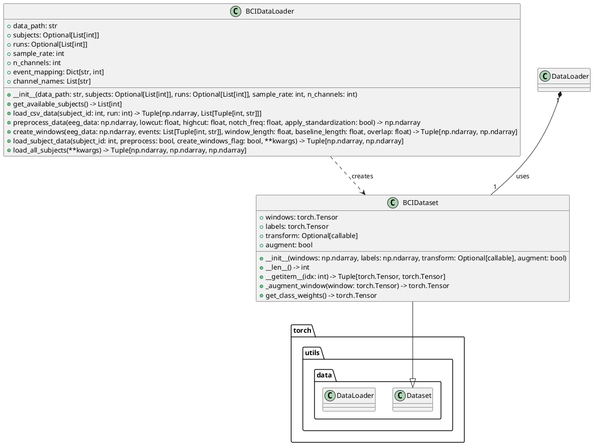

# Project Documentation

This document provides an overview of the project structure and key components.

## Data Loading (`src/data/data_loader.py`)

The `data_loader.py` module is responsible for loading, preprocessing, and windowing the EEG data from the PhysioNet Motor Imagery Dataset.

### PlantUML Diagram

### Class Descriptions

#### `BCIDataLoader`
Handles loading CSV files from the PhysioNet Motor Imagery dataset, extracting events, preprocessing (filtering, standardization), and creating windowed data suitable for CNN training.

#### `BCIDataset`
A PyTorch `Dataset` class that wraps the windowed EEG data and labels, making it compatible with PyTorch `DataLoader` for batching and training. It also supports optional data augmentation and transformations.

### Key Functions

-   `create_data_loaders(...)`: A utility function that takes a `BCIDataLoader` instance, loads all subject data, splits it into training, validation, and test sets (subject-wise), and returns PyTorch `DataLoader` instances for each set.

