# BCI System Architecture Documentation

## Overview

The BCI EEG Motor Imagery Classification System implements a sophisticated architecture designed for both research and clinical applications, with clear separation of concerns and modular design principles.

## High-Level Architecture

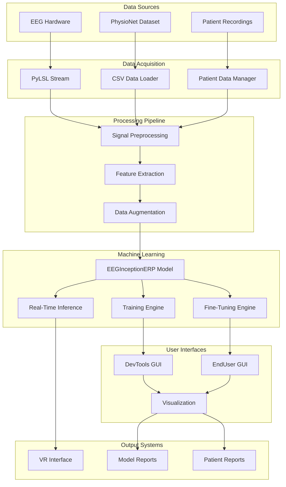

## Component Architecture

### 1. DevTools Architecture

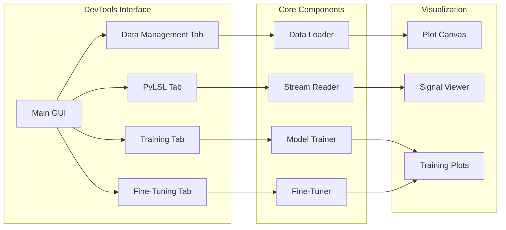

### 2. EndUser Architecture

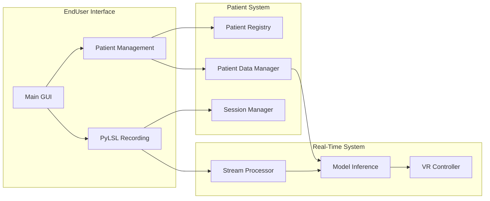

## Data Flow Architecture

### Training Data Flow

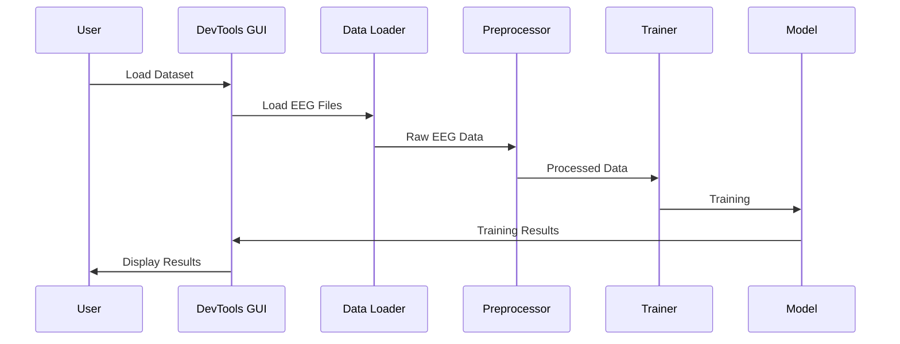

### Real-Time Processing Flow

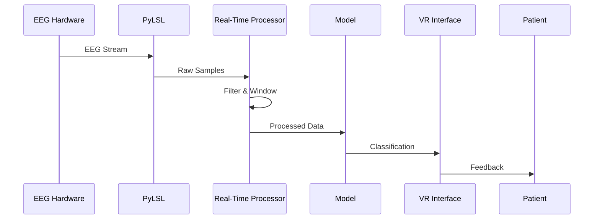

## Module Dependencies

### Core Dependencies

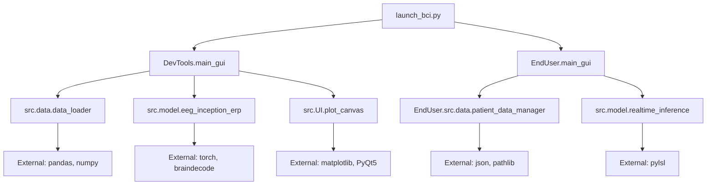

## Security Architecture

### Data Protection

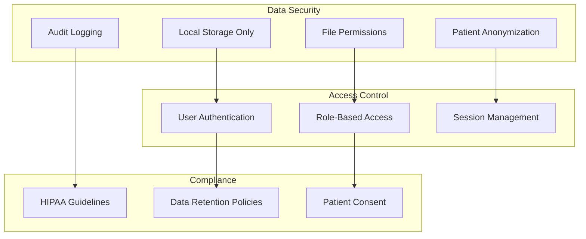

## Performance Architecture

### System Performance Considerations

| Component | Target Performance | Current Implementation |
|-----------|-------------------|----------------------|
| Data Loading | < 5s for 100MB dataset | Optimized pandas/numpy |
| Model Training | < 30 epochs convergence | Early stopping, LR scheduling |
| Real-Time Inference | < 100ms latency | PyTorch inference, GPU acceleration |
| GUI Responsiveness | < 100ms UI updates | Qt threading, async processing |
| Memory Usage | < 4GB RAM | Efficient data structures |

### Scalability Design

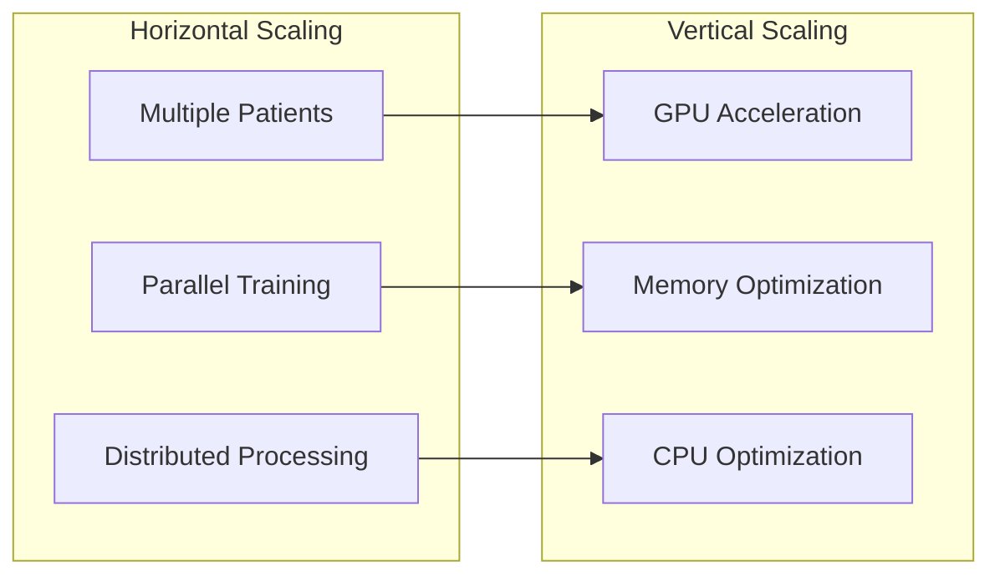

## Deployment Architecture

### Development Environment

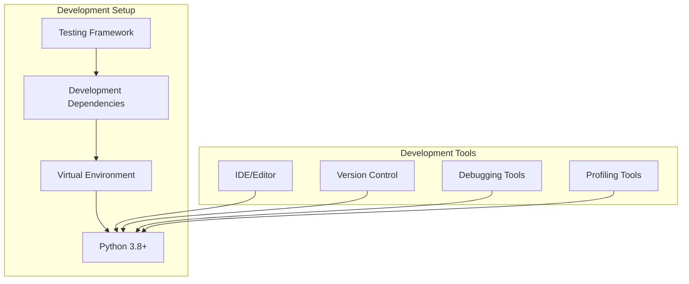

### Production Deployment

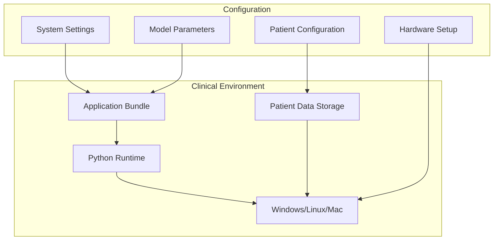

## Integration Points

### External System Integration

| System | Interface | Protocol | Purpose |
|--------|-----------|----------|---------|
| EEG Hardware | PyLSL | TCP/IP | Real-time data streaming |
| VR Systems | Custom API | TCP/UDP | Control interface |
| Database Systems | File I/O | CSV/JSON | Data persistence |
| Cloud Services | REST API | HTTPS | Data backup (optional) |

### API Endpoints

#### Internal APIs

```python
# Data Management API
class DataManager:
    def load_dataset(path: str) -> Dataset
    def preprocess_data(data: np.ndarray) -> np.ndarray
    def save_processed_data(data: np.ndarray, path: str) -> None

# Model Management API  
class ModelManager:
    def train_model(data: Dataset, config: dict) -> Model
    def fine_tune_model(model: Model, data: Dataset) -> Model
    def evaluate_model(model: Model, data: Dataset) -> dict

# Patient Management API
class PatientManager:
    def register_patient(info: dict) -> str
    def get_patient_data(patient_id: str) -> dict
    def update_patient_data(patient_id: str, data: dict) -> None
```

## Error Handling Architecture

### Error Classification

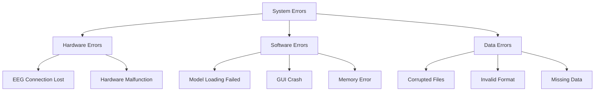

### Recovery Strategies

| Error Type | Recovery Strategy | User Impact |
|------------|------------------|-------------|
| Connection Lost | Auto-reconnect with backoff | Minimal - transparent |
| Model Loading Failed | Fallback to default model | Moderate - notification |
| Data Corruption | Data validation and repair | High - user intervention |
| Memory Error | Garbage collection and optimization | Moderate - performance impact |
| GUI Crash | Graceful restart with state recovery | High - data loss prevention |

## Monitoring and Logging

### System Monitoring

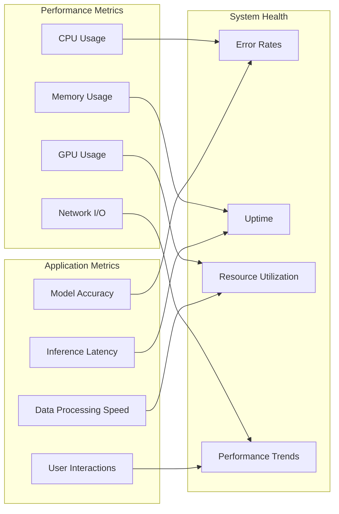

This architecture documentation provides a comprehensive view of the BCI system's design, ensuring maintainability, scalability, and reliability for both research and clinical applications.
