# 🏗️ System Architecture

## Overview

The BCI EEG Motor Imagery Classification System implements a sophisticated, modular architecture designed for scalability, maintainability, and clinical compliance. The system follows modern software engineering principles with clear separation of concerns, robust error handling, and comprehensive logging.

## 🌟 High-Level Architecture


## 🔧 Component Architecture

### 1. Application Launcher (`launch_bci.py`)

**Purpose**: Centralized entry point with environment validation and mode selection.

```python
# Architecture Pattern: Command Pattern + Factory Pattern
class ApplicationLauncher:
    """
    Responsible for:
    - Environment validation (Python version, dependencies)
    - Logging configuration
    - Mode-based application initialization
    - Error handling and graceful degradation
    """
```

**Key Features**:
- ✅ Dependency validation with version checking
- 🔒 Secure environment setup with proper path handling
- 📝 Centralized logging configuration
- 🎯 Mode-based launching (GUI, CLI, batch)

### 2. Data Management Layer

#### 2.1 Patient Data Manager (`EndUser/src/data/patient_data_manager.py`)

```python
# Architecture Pattern: Repository Pattern + Observer Pattern
class PatientDataManager:
    """
    Clinical-grade patient data management with:
    - HIPAA-compliant data organization
    - Structured folder hierarchy
    - Session tracking and metadata
    - Audit trail logging
    """
```

**Folder Structure**:
```
patient_data/
├── patients_registry.json          # Master patient index
└── {patient_id}/
    ├── eeg_recordings/             # Raw EEG data
    ├── processed_data/             # Preprocessed datasets
    ├── models/                     # Patient-specific models
    ├── reports/                    # Analysis reports
    └── sessions/                   # Session metadata
```

#### 2.2 Data Loader (`src/data/data_loader.py`)

```python
# Architecture Pattern: Strategy Pattern + Pipeline Pattern
class EEGDataLoader:
    """
    Handles multiple data sources with:
    - PhysioNet dataset integration
    - CSV file processing
    - Real-time stream handling
    - Preprocessing pipeline coordination
    """
```

### 3. Machine Learning Architecture

#### 3.1 Model Architecture (`src/model/eeg_inception_erp.py`)

```python
# Architecture Pattern: Builder Pattern + Template Method
class EEGInceptionERP:
    """
    State-of-the-art CNN architecture featuring:
    - Inception-style convolutional blocks
    - Temporal and spatial feature extraction
    - Dropout regularization
    - Batch normalization
    """
```

**Model Pipeline**:

```mermaid
graph LR
    A[Raw EEG<br/>Channels × Time] --> B[Temporal Conv<br/>Feature Maps]
    B --> C[Inception Blocks<br/>Multi-scale Features]
    C --> D[Spatial Conv<br/>Channel Reduction]
    D --> E[Classification<br/>Left/Right Output]
```


#### 3.2 Training Engine (`src/model/train_model.py`)

```python
# Architecture Pattern: Strategy Pattern + Observer Pattern
class ModelTrainer:
    """
    Comprehensive training system with:
    - K-fold cross-validation
    - Early stopping with patience
    - Learning rate scheduling
    - Model checkpointing
    - Performance monitoring
    """
```

#### 3.3 Fine-Tuning Engine (`src/model/fine_tuning.py`)

```python
# Architecture Pattern: Strategy Pattern + Adapter Pattern
class ModelFineTuner:
    """
    Patient-specific adaptation featuring:
    - Transfer learning strategies
    - Layer freezing options
    - Adaptive learning rates
    - Performance validation
    """
```

## 🖥️ User Interface Architecture

### 1. DevTools Interface

#### Architecture Pattern: Model-View-Controller (MVC)

```python
# Main Controller
class MainWindow(QMainWindow):
    """
    Central controller coordinating:
    - Data management operations
    - Model training workflows
    - Fine-tuning processes
    - Live stream analysis
    """

# Specialized View Components
class DataManagementTab(QWidget):     # Data operations
class TrainingTab(QWidget):           # Model training
class FineTuningTab(QWidget):         # Patient adaptation
class PylslTab(QWidget):              # Live streaming
```

### 2. EndUser (Clinical) Interface

#### Architecture Pattern: MVP (Model-View-Presenter)

```python
# Clinical Controller
class ClinicalMainWindow(QMainWindow):
    """
    Streamlined clinical interface with:
    - Patient management workflows
    - Real-time EEG monitoring
    - Session recording capabilities
    - Progress tracking
    """

# Clinical View Components
class PatientManagementTab(QWidget):  # Patient operations
class PylslTab(QWidget):              # EEG acquisition
```

## 📡 Real-Time Processing Architecture

### PyLSL Integration

```python
# Architecture Pattern: Observer Pattern + Producer-Consumer
class LSLStreamHandler:
    """
    Real-time EEG processing with:
    - Multi-threaded stream handling
    - Buffer management
    - Artifact detection
    - Real-time visualization
    """
```

**Processing Pipeline**:


## 🔒 Security and Compliance Architecture

### Data Protection

```python
# Architecture Pattern: Decorator Pattern + Strategy Pattern
class DataProtectionLayer:
    """
    HIPAA-compliant data handling with:
    - Local-only data storage
    - Access control mechanisms
    - Audit trail logging
    - Data anonymization options
    """
```

### Privacy Features

- 🔐 **Local Storage Only**: No cloud transmission
- 👤 **Patient ID Anonymization**: Configurable ID schemes
- 📝 **Audit Trails**: Complete operation logging
- 🔒 **Access Controls**: Role-based permissions

## 📊 Data Flow Architecture

### Training Data Flow


### Clinical Data Flow


## 🧪 Testing Architecture

### Test Pyramid Structure

```python
# Unit Tests (Base Layer)
class TestEEGInceptionERP:          # Model architecture tests
class TestDataLoader:               # Data processing tests
class TestPatientManager:           # Clinical data tests

# Integration Tests (Middle Layer)
class TestTrainingPipeline:         # End-to-end training
class TestRealTimeProcessing:       # Live stream tests
class TestGUIIntegration:           # Interface tests

# System Tests (Top Layer)
class TestClinicalWorkflow:         # Complete clinical scenarios
class TestResearchWorkflow:         # Complete research scenarios
```

## 📈 Performance Architecture

### Optimization Strategies

1. **Memory Management**
   - Efficient tensor operations with PyTorch
   - Streaming data processing to minimize RAM usage
   - Garbage collection optimization

2. **Compute Optimization**
   - CUDA acceleration for model training/inference
   - Multi-threaded data loading
   - Vectorized signal processing operations

3. **I/O Optimization**
   - Asynchronous file operations
   - Efficient CSV parsing with pandas
   - Optimized model serialization

## 🔧 Configuration Architecture

### Hierarchical Configuration System

```yaml
# config/default.yaml
system:
  logging_level: INFO
  temp_directory: "./temp"

model:
  architecture: "EEGInceptionERP"
  batch_size: 32
  learning_rate: 0.001

clinical:
  data_retention_days: 2555  # 7 years
  backup_frequency: "daily"
```

## 🚀 Deployment Architecture

### Development Deployment
```bash
# Development server with hot reload
python launch_bci.py --mode gui --debug
```

### Clinical Deployment
```bash
# Production clinical environment
python launch_enduser.bat
```

### Research Deployment
```bash
# High-performance research environment
python launch_bci.py --mode gui --gpu --batch-size 64
```

---

This architecture ensures **scalability**, **maintainability**, and **clinical compliance** while providing the flexibility needed for cutting-edge BCI research and practical clinical applications.
